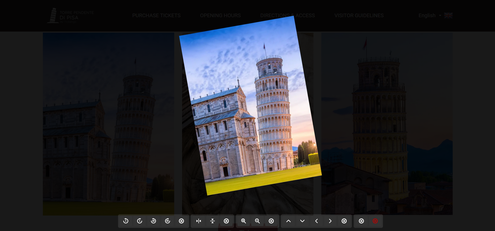

<!-- 介绍 -->

    
    <h1>AdvancedImageViewer</h1>
    <h3>一个浏览器 MV2 插件，可以通过右键菜单旋转、缩放、翻转和平移来查看图像</h3>

<!-- 徽章 -->

# 截图

# 功能

 - 旋转:顺时针/逆时针 5°或90°
 - 翻转
 - 平移
 - 缩放

# TODO
 - 动态检测页面最大zIndex元素，以确保插件显示在最上方
 - 显示各种变换的具体状态，如“旋转:15°,缩放:230%,平移:x+20px,y-130px”
 - 通过点击插件图标设置最小旋转度数，如将5°设置为1°

# 支持语言

 - de
 - en
 - es
 - fr
 - hi
 - id
 - it
 - ja
 - ko
 - pt_BR
 - pt_PT
 - ru
 - th
 - vi
 - zh-CN
 - zh-TW

# 许可证

MIT license

# 相关链接

https://addons.mozilla.org/zh-CN/firefox/addon/advanced-image-viewer/
